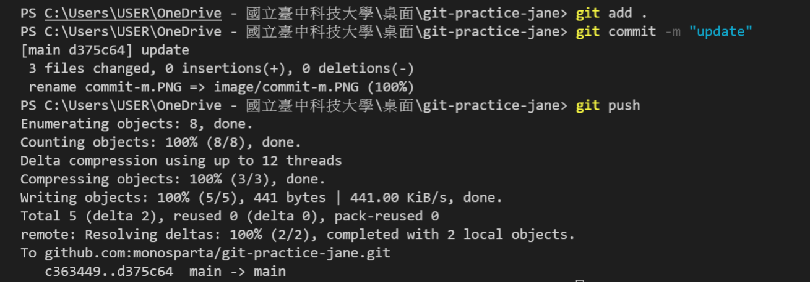
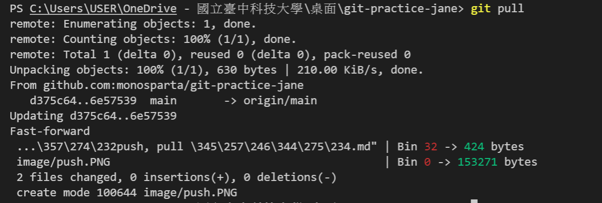

# Git Push
### 實作
> 1. ```git add .```將要推上去的檔案加至暫存區
> 2. ```git commit -m "update"```將暫存區的檔案提交到儲存庫儲存，並且說明這次的commit做了什麼事
> 3. ```git push```將所有本地分支提交上傳到相應的遠程分支

### ```Git Push```常見用法
* ```git push -f```：強制推送否則會被阻止，通常是因為它會刪除或覆蓋現有提交（謹慎使用！）
* ```git push -u origin [branch]```：在推送新分支時很有用，這會創建一個與本地分支有持久關係的上游跟踪分支
* ```git push --all```：推送所有分支
* ```git push --tags```：發布尚未在遠程存儲庫中的標籤
# Git Pull
### 實作
>```git pull```更新當前的進度

### ```Git Pull```常見用法
* ```git pull --rebase```：使用來自遠程的提交更新您的本地工作分支，但重寫歷史記錄，以便在所有來自遠程的新提交之後發生任何本地提交，避免合併提交。
* ```git pull --force<refspec>```：允許使用因衝突而無法獲取的選項時，強制獲取特定的遠程跟踪分支
* ```git pull --all```：獲取所有```remote```，如果正在使用 fork 或其他具有多個```remote```時，這很方便
